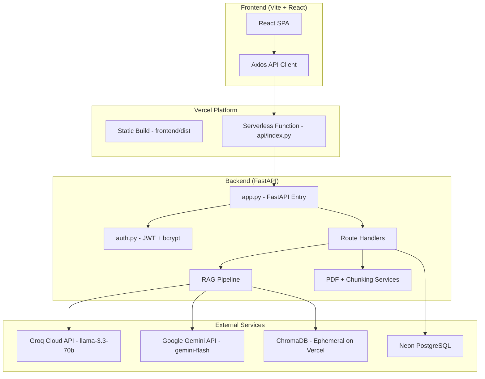

# cappy.ai -- Project Documentation

> Study Intelligence Platform

---

## 1. Project Overview

cappy.ai is a full-stack AI-powered study assistant that enables students to upload their course PDFs, ask questions grounded in those documents, generate summaries, quizzes, flashcards, university-format exam papers, and step-by-step model solutions. The platform is built with a React frontend and a Python FastAPI backend, deployed on Vercel with Neon PostgreSQL as the persistent database.

### Live URL

```
https://cappy-ai-nine.vercel.app
```

---

## 2. Architecture



### Request Flow

1. The user interacts with the React frontend served as static files from Vercel.
2. All API calls go to `/api/*` which Vercel routes to the Python serverless function at `api/index.py`.
3. `api/index.py` imports `app` from `backend/app.py`, which is the FastAPI application.
4. FastAPI handles routing, authentication, database access, and AI generation.
5. Responses are returned to the frontend as JSON.

---

## 3. Technology Stack

### Frontend

| Technology | Purpose |
|---|---|
| React 18 | Component-based UI framework |
| Vite 5 | Build tool and dev server |
| React Router DOM 6 | Client-side routing |
| Axios | HTTP client with JWT interceptors |
| Lucide React | Icon library |
| React Hot Toast | Toast notification system |
| React Markdown + remark-gfm | Markdown rendering for AI outputs |
| html2pdf.js | Client-side PDF generation and download |
| Framer Motion | Page transition animations |
| Vanilla CSS | Custom design system with CSS variables |

### Backend

| Technology | Purpose |
|---|---|
| FastAPI | Async Python web framework |
| SQLAlchemy 2.0 | ORM for PostgreSQL and SQLite |
| psycopg 3 | PostgreSQL adapter (Neon DB) |
| pdfplumber | PDF text extraction |
| Pillow | Image processing for OCR fallback |
| python-jose | JWT token creation and verification |
| bcrypt | Password hashing |
| ChromaDB | Vector store for embeddings (local only) |
| NumPy | Lightweight fallback embedding vectors |
| google-generativeai | Gemini API client (secondary AI provider) |
| groq | Groq API client (primary AI provider) |

### Infrastructure

| Service | Purpose |
|---|---|
| Vercel | Hosting (frontend static + backend serverless) |
| Neon PostgreSQL | Persistent relational database |
| Groq Cloud | Primary LLM inference (llama-3.3-70b-versatile) |
| Google Gemini | Secondary LLM inference (gemini-flash-latest) |

---

## 4. Directory Structure

```
cappy.ai-git/
├── api/
│   └── index.py                  # Vercel serverless entry point
├── backend/
│   ├── app.py                    # FastAPI application factory
│   ├── auth.py                   # JWT + bcrypt authentication utilities
│   ├── config.py                 # Centralized settings from env vars
│   ├── database.py               # SQLAlchemy engine, session, init_db
│   ├── requirements.txt          # Python dependencies
│   ├── .env                      # Environment variables (not in git)
│   ├── .env.example              # Environment template
│   ├── models/
│   │   ├── __init__.py           # Re-exports all models
│   │   ├── user.py               # User model
│   │   ├── document.py           # Document model (uploaded PDFs)
│   │   ├── document_chunk.py     # DocumentChunk model (persistent search)
│   │   ├── conversation.py       # Conversation + Message models
│   │   ├── generated_paper.py    # GeneratedPaper model (paper text cache)
│   │   └── paper_solve_usage.py  # PaperSolveUsage model (daily rate limit)
│   ├── routes/
│   │   ├── auth.py               # POST /api/auth/register, /api/auth/login
│   │   ├── documents.py          # PDF upload, list, delete, category
│   │   ├── chat.py               # RAG chat with conversation history
│   │   ├── summary.py            # Document summarization
│   │   ├── quiz.py               # MCQ quiz generation
│   │   ├── flashcards.py         # Flashcard generation
│   │   ├── sample_paper.py       # Exam paper generation + solving
│   │   ├── search.py             # Deep semantic + full-text search
│   │   └── users.py              # User profile CRUD
│   ├── rag/
│   │   ├── embeddings.py         # Embedding generation (local + fallback)
│   │   ├── generator.py          # Multi-provider AI text generation
│   │   └── vector_store.py       # ChromaDB + in-memory vector search
│   └── services/
│       ├── pdf_service.py        # PDF text extraction with OCR fallback
│       └── chunking_service.py   # Sliding window text chunking
├── frontend/
│   ├── package.json              # Node dependencies
│   ├── vite.config.js            # Vite build configuration
│   └── src/
│       ├── main.jsx              # React DOM render entry
│       ├── App.jsx               # Router + layout + providers
│       ├── index.css             # Complete design system
│       ├── context/
│       │   ├── AuthContext.jsx    # Authentication state provider
│       │   └── ThemeContext.jsx   # Dark/light mode + color themes
│       ├── services/
│       │   ├── api.js            # Axios instance with JWT interceptors
│       │   └── index.js          # Service layer (all API calls)
│       ├── components/
│       │   ├── Navbar.jsx        # Top navigation bar
│       │   ├── Sidebar.jsx       # Chat sidebar with conversations
│       │   ├── FileUpload.jsx    # Chunked PDF upload component
│       │   ├── DocumentCard.jsx  # Document card with actions
│       │   ├── CategoryDocumentSelector.jsx  # Multi-select doc picker
│       │   ├── MarkdownRenderer.jsx          # Markdown display
│       │   ├── SourceCitationCard.jsx        # RAG source citations
│       │   ├── LoadingSpinner.jsx            # Loading indicator
│       │   ├── TypingIndicator.jsx           # Chat typing dots
│       │   └── ProtectedRoute.jsx            # Auth guard wrapper
│       └── pages/
│           ├── LoginPage.jsx       # Login form
│           ├── RegisterPage.jsx    # Registration form
│           ├── DashboardPage.jsx   # Overview: docs, stats, upload
│           ├── SummaryPage.jsx     # Summary generation UI
│           ├── QuizPage.jsx        # Quiz + flashcard UI
│           ├── SamplePaperPage.jsx # Exam paper generate + solve UI
│           ├── SearchPage.jsx      # Deep search UI
│           ├── ChatPage.jsx        # RAG chat interface
│           └── SettingsPage.jsx    # Profile, security, theme, about
└── vercel.json                   # Vercel build + route configuration
```

---

## 5. Database Schema

All tables are hosted on **Neon PostgreSQL** in production and SQLite locally.

### users

| Column | Type | Description |
|---|---|---|
| id | Integer (PK) | Auto-increment primary key |
| full_name | String(120) | User display name |
| email | String(255) | Unique login email |
| hashed_password | String(255) | bcrypt-hashed password |
| is_active | Boolean | Account active flag |
| avatar_url | String(500) | Optional avatar URL |
| created_at | DateTime | Account creation timestamp |
| updated_at | DateTime | Last update timestamp |

### documents

| Column | Type | Description |
|---|---|---|
| id | Integer (PK) | Auto-increment primary key |
| user_id | Integer (FK) | Owner reference to users.id |
| filename | String(255) | Original uploaded filename |
| stored_filename | String(255) | UUID-based filename on disk |
| file_path | String(500) | Full path to stored file |
| file_size | BigInteger | File size in bytes |
| page_count | Integer | Number of PDF pages |
| chunk_count | Integer | Number of text chunks created |
| status | String(50) | processing, ready, or failed |
| category | String(100) | User-defined category tag |
| chroma_collection_id | String(255) | ChromaDB collection reference |
| created_at | DateTime | Upload timestamp |
| updated_at | DateTime | Last update timestamp |

### document_chunks

| Column | Type | Description |
|---|---|---|
| id | Integer (PK) | Auto-increment primary key |
| document_id | Integer (FK) | Reference to documents.id |
| user_id | Integer (FK) | Reference to users.id |
| document_name | String(255) | Source document filename |
| page | Integer | Source page number |
| chunk_index | Integer | Sequential chunk index |
| text | Text | The chunk text content |
| created_at | DateTime | Creation timestamp |

### conversations

| Column | Type | Description |
|---|---|---|
| id | Integer (PK) | Auto-increment primary key |
| user_id | Integer (FK) | Owner reference to users.id |
| title | String(255) | Conversation title (auto-generated) |
| created_at | DateTime | Creation timestamp |
| updated_at | DateTime | Last message timestamp |

### messages

| Column | Type | Description |
|---|---|---|
| id | Integer (PK) | Auto-increment primary key |
| conversation_id | Integer (FK) | Reference to conversations.id |
| role | String(20) | "user" or "assistant" |
| content | Text | Message text |
| sources | Text | JSON string of source citations |
| created_at | DateTime | Message timestamp |

### generated_papers

| Column | Type | Description |
|---|---|---|
| id | Integer (PK) | Auto-increment primary key |
| paper_id | String(64) | Short UUID for paper identification |
| user_id | Integer (FK) | Reference to users.id |
| content | Text | Full paper markdown text |
| created_at | DateTime | Generation timestamp |

### paper_solve_usage

| Column | Type | Description |
|---|---|---|
| id | Integer (PK) | Auto-increment primary key |
| user_id | Integer (FK) | Reference to users.id |
| solve_date | Date | Calendar date of solves |
| solve_count | Integer | Number of solves on that date |
| *Constraint* | UNIQUE | (user_id, solve_date) |

---

## 6. API Reference

All endpoints are prefixed with `/api`. Authentication is via JWT Bearer token in the `Authorization` header.

### Authentication

| Method | Endpoint | Auth | Description |
|---|---|---|---|
| POST | `/api/auth/register` | No | Create a new user account |
| POST | `/api/auth/login` | No | Authenticate and receive JWT token |

**Register request body:**
```json
{ "full_name": "Yaksh", "email": "user@example.com", "password": "securepass" }
```

**Login response:**
```json
{ "access_token": "eyJ...", "token_type": "bearer" }
```

---

### Documents

| Method | Endpoint | Auth | Description |
|---|---|---|---|
| POST | `/api/documents/upload-chunk` | Yes | Upload one chunk of a PDF (chunked upload) |
| POST | `/api/documents/upload` | Yes | Legacy single-file upload |
| GET | `/api/documents/` | Yes | List all user documents |
| GET | `/api/documents/{id}` | Yes | Get single document details |
| DELETE | `/api/documents/{id}` | Yes | Delete a document |
| PATCH | `/api/documents/{id}/category` | Yes | Update document category |

**Chunked upload headers:**
```
upload_id: <unique-id>
chunk_index: 0
total_chunks: 3
original_filename: Unit-7.pdf
```

---

### Chat (RAG)

| Method | Endpoint | Auth | Description |
|---|---|---|---|
| POST | `/api/chat/` | Yes | Send a question and receive an AI answer |
| GET | `/api/chat/conversations` | Yes | List all conversations |
| GET | `/api/chat/conversations/{id}/messages` | Yes | Get messages in a conversation |
| DELETE | `/api/chat/conversations/{id}` | Yes | Delete a conversation |

**Chat request body:**
```json
{
  "question": "What is MQTT protocol?",
  "conversation_id": null,
  "document_ids": [16, 18]
}
```

**Chat response:**
```json
{
  "answer": "MQTT (Message Queuing Telemetry Transport) is...",
  "sources": [{"text": "...", "document_name": "Unit-7.pdf", "page": 5, "score": 0.87}],
  "conversation_id": 12,
  "message_id": 45
}
```

---

### Summaries

| Method | Endpoint | Auth | Description |
|---|---|---|---|
| POST | `/api/summary/` | Yes | Generate a summary from selected documents |

**Request body:**
```json
{
  "document_ids": [16, 18],
  "mode": "detailed",
  "topic": "IoT Security"
}
```

Modes: `short`, `detailed`, `bullets`

---

### Quiz and Flashcards

| Method | Endpoint | Auth | Description |
|---|---|---|---|
| POST | `/api/quiz/` | Yes | Generate MCQ or flashcard quiz |
| POST | `/api/flashcards/` | Yes | Generate flashcards |

**Quiz request body:**
```json
{
  "document_ids": [16, 18],
  "quiz_type": "mcq",
  "num_questions": 10,
  "topic": "IoT Protocols"
}
```

Quiz types: `mcq`, `flashcards`

---

### Sample Paper (Exam Paper Generation)

| Method | Endpoint | Auth | Description |
|---|---|---|---|
| POST | `/api/sample-paper/` | Yes | Generate a university-format exam paper |
| POST | `/api/sample-paper/solve-upload` | Yes | Upload a PDF and generate model solutions |

**Generate request body:**
```json
{
  "document_ids": [16, 18],
  "university_name": "Gujarat Technological University",
  "subject_code": "3160716",
  "subject_name": "IOT and Applications",
  "exam_term": "SUMMER 2024",
  "total_marks": 70
}
```

**Solve upload:** Multipart form with `file` (PDF), `document_ids`, `subject_name`.

Rate limit: 7 paper solves per user per day.

---

### Deep Search

| Method | Endpoint | Auth | Description |
|---|---|---|---|
| POST | `/api/search/` | Yes | Semantic and full-text search |

**Request body:**
```json
{
  "query": "MQTT security vulnerabilities",
  "document_ids": [16, 18],
  "n_results": 15
}
```

Search first attempts vector similarity via ChromaDB, then falls back to PostgreSQL full-text keyword matching against the `document_chunks` table.

---

### Users

| Method | Endpoint | Auth | Description |
|---|---|---|---|
| GET | `/api/users/me` | Yes | Get current user profile |
| PATCH | `/api/users/me` | Yes | Update profile (name, email) |
| POST | `/api/users/me/change-password` | Yes | Change password |

---

### Health Check

| Method | Endpoint | Auth | Description |
|---|---|---|---|
| GET | `/api/health` | No | Returns `{"status": "ok"}` |

---

## 7. AI Provider Chain

The backend uses a cascading multi-provider strategy defined in [generator.py](file:///d:/Study/extra/codes/cappy.ai-git/backend/rag/generator.py):

| Priority | Provider | Model | Speed | Use Case |
|---|---|---|---|---|
| 1 (Primary) | Groq Cloud | llama-3.3-70b-versatile | ~500 tokens/sec | All generation tasks |
| 2 (Fallback) | Google Gemini | gemini-flash-latest | ~100 tokens/sec | If Groq fails |
| 3 (Local) | Ollama | llama3.2:3b | Variable | Offline development |

If Provider 1 fails (rate limit, network error), it automatically falls back to Provider 2, then Provider 3. All three failures raise a `RuntimeError`.

### Generation Functions

| Function | Output | Purpose |
|---|---|---|
| `generate_answer(question, chunks)` | Markdown string | RAG chat answers with citations |
| `generate_summary(text, mode, topic)` | Markdown string | Document summarization |
| `generate_quiz(text, quiz_type, num)` | JSON string | MCQ quiz questions |
| `generate_flashcards(text, num)` | JSON string | Study flashcards |
| `generate_sample_paper(text, ...)` | JSON string | University exam paper |
| `solve_question_paper(text, context, subject)` | JSON string | Step-by-step model solutions |

---

## 8. RAG Pipeline

### Document Ingestion

1. **Upload**: User uploads a PDF via the chunked upload endpoint. Chunks are reassembled on the server.
2. **Text Extraction**: `pdf_service.py` uses `pdfplumber` to extract text from each page. If a page has fewer than 15 characters, it attempts OCR via `pytesseract` (if available).
3. **Chunking**: `chunking_service.py` splits page text into overlapping chunks using a sliding window (default: 1000 characters with 200 character overlap).
4. **PostgreSQL Storage**: All chunks are saved to the `document_chunks` table in Neon PostgreSQL for permanent full-text search.
5. **Vector Embedding**: Chunks are embedded using `SentenceTransformer('all-MiniLM-L6-v2')` locally, or a lightweight hash-based fallback on Vercel, then stored in ChromaDB.

### Query Flow

1. User submits a question or search query.
2. The query is embedded using the same embedding model.
3. ChromaDB performs cosine similarity search to find the top-K most relevant chunks.
4. If ChromaDB is empty (Vercel ephemeral storage), the system falls back to PostgreSQL `ILIKE` keyword matching on the `document_chunks` table.
5. Retrieved chunks are formatted into a context block and sent to the LLM along with the user's question.
6. The LLM generates a grounded answer citing specific chunks.

---

## 9. Embedding Strategy

Defined in [embeddings.py](file:///d:/Study/extra/codes/cappy.ai-git/backend/rag/embeddings.py):

| Environment | Method | Dimensions |
|---|---|---|
| Local Development | SentenceTransformer `all-MiniLM-L6-v2` | 384 |
| Vercel Serverless | Lightweight MD5 hash-based vector | 384 |

The hash-based fallback generates deterministic 384-dimensional normalized vectors by hashing each word with MD5 and mapping to vector indices. This enables basic vector similarity without requiring heavy ML model loading in serverless environments.

---

## 10. Authentication System

- **Password Hashing**: bcrypt with automatic salt generation.
- **Token Format**: JWT (JSON Web Token) signed with HS256.
- **Token Lifetime**: 10,080 minutes (7 days) by default.
- **Token Transport**: `Authorization: Bearer <token>` header on every API request.
- **Auto-Logout**: The frontend Axios interceptor detects 401 responses and redirects to `/login`.

---

## 11. Frontend Pages

| Route | Page Component | Description |
|---|---|---|
| `/login` | LoginPage | Email and password login form |
| `/register` | RegisterPage | New account registration form |
| `/dashboard` | DashboardPage | Document overview, upload, stats |
| `/summary` | SummaryPage | Generate summaries (short, detailed, bullets) |
| `/quiz` | QuizPage | Generate MCQ quizzes and flashcards |
| `/sample-paper` | SamplePaperPage | Generate and solve exam papers |
| `/search` | SearchPage | Deep semantic search across documents |
| `/settings` | SettingsPage | Profile, security, appearance, about |

### Design System

The UI uses a custom CSS design system defined in [index.css](file:///d:/Study/extra/codes/cappy.ai-git/frontend/src/index.css) with:

- CSS custom properties for theming (`--bg`, `--surface`, `--text`, `--accent`, etc.)
- Dark mode and light mode support
- Multiple color palettes: Ember (red), Ocean (blue), Sage (green), Amethyst (purple), Amber (gold), Graphite (gray)
- Reusable utility classes: `.card`, `.btn`, `.btn-primary`, `.btn-ghost`, `.input`, `.tag`, `.skeleton`
- Typography via Google Fonts: Inter (body) and Space Grotesk (display headings)

### Theme System

Managed by [ThemeContext.jsx](file:///d:/Study/extra/codes/cappy.ai-git/frontend/src/context/ThemeContext.jsx):

- Persisted to `localStorage` keys `theme-mode` and `theme-color`.
- Applied by toggling `data-theme` and `data-color` attributes on the document root.
- Instant preview switching in the Settings page.

---

## 12. Deployment Configuration

### vercel.json

```json
{
  "version": 2,
  "builds": [
    { "src": "api/index.py", "use": "@vercel/python" },
    { "src": "frontend/package.json", "use": "@vercel/static-build" }
  ],
  "routes": [
    { "src": "/api/(.*)", "dest": "api/index.py" },
    { "src": "/assets/(.*)", "dest": "frontend/assets/$1" },
    { "src": "/favicon.svg", "dest": "frontend/favicon.svg" },
    { "src": "/(.*)", "dest": "frontend/index.html" }
  ]
}
```

- All `/api/*` requests are routed to the Python serverless function.
- All other requests serve the React SPA's `index.html` for client-side routing.
- Static assets (JS bundles, CSS) are served from `frontend/assets/`.

### Vercel Environment Variables

The following must be set in Vercel's project settings under Environment Variables:

| Variable | Required | Description |
|---|---|---|
| `GROQ_API_KEY` | Yes | Groq Cloud API key for primary LLM inference |
| `GEMINI_API_KEY` | Optional | Google Gemini API key (fallback provider) |
| `DATABASE_URL` | Yes | Neon PostgreSQL connection string |
| `SECRET_KEY` | Yes | JWT signing secret |

### Vercel-Specific Constraints

1. **Read-only filesystem**: All file writes must go to `/tmp`. The `config.py` detects the `VERCEL` environment variable and redirects `UPLOAD_DIR` and `CHROMA_PERSIST_DIR` to `/tmp`.
2. **Ephemeral `/tmp`**: Files in `/tmp` are lost when a serverless function container is recycled. This is why all persistent data (document chunks, generated papers, user data) is stored in Neon PostgreSQL.
3. **No background threads**: Vercel kills background threads after the HTTP response is sent. Document processing runs synchronously within the upload request handler.
4. **10-second timeout**: Serverless functions on the free tier have a 10-second execution limit. AI generation calls to Groq typically complete in under 3 seconds.

---

## 13. Environment Setup (Local Development)

### Prerequisites

- Python 3.11 or higher
- Node.js 18 or higher
- A Groq API key (free at https://console.groq.com)

### Backend Setup

```bash
cd backend
python -m venv venv
venv\Scripts\activate          # Windows
source venv/bin/activate       # macOS/Linux
pip install -r requirements.txt
cp .env.example .env           # Edit .env with your API keys
python app.py                  # Starts uvicorn on http://localhost:8000
```

### Frontend Setup

```bash
cd frontend
npm install
npm run dev                    # Starts Vite dev server on http://localhost:5173
```

### Local Database

By default, the backend uses SQLite (`cappy.db`) for local development. To use PostgreSQL locally, set `DATABASE_URL` in `.env` to a PostgreSQL connection string.

---

## 14. Rate Limiting

| Feature | Limit | Scope | Storage |
|---|---|---|---|
| Paper Solving | 7 per day | Per user | PostgreSQL `paper_solve_usage` table |
| All other features | Unlimited | -- | -- |

The daily limit resets at midnight UTC. When the limit is reached, the API returns HTTP 429 with the message: "Daily limit reached! You can solve up to 7 question papers per day."

---

## 15. Security Considerations

- Passwords are hashed with bcrypt before storage. Plain-text passwords are never persisted.
- JWT tokens are signed with HS256 using the `SECRET_KEY` environment variable.
- All API endpoints (except `/auth/register`, `/auth/login`, `/health`) require a valid JWT.
- Document access is scoped to the authenticated user via `user_id` filtering on every query.
- CORS is configured to accept all origins (`allow_origins=["*"]`). For production hardening, this should be restricted to the deployment domain.
- API keys are stored in Vercel environment variables and never exposed to the frontend.

---

## 16. Key Design Decisions

1. **Synchronous document processing on Vercel**: Background threads are killed by Vercel after the HTTP response. All PDF extraction, chunking, and database writes happen synchronously during the upload request to guarantee data persistence.

2. **Dual-layer search (ChromaDB + PostgreSQL)**: ChromaDB provides fast vector similarity search locally but its data is ephemeral on Vercel. The `document_chunks` PostgreSQL table provides a permanent full-text search fallback that works reliably across all serverless function invocations.

3. **Generated paper caching in PostgreSQL**: When a sample paper is generated, its full markdown text is saved to the `generated_papers` table. When the user downloads the paper as PDF and re-uploads it to "Solve", the system retrieves the text by paper ID from the database instead of requiring OCR or Gemini Vision API.

4. **Multi-provider AI fallback**: The generator cascades through Groq, Gemini, and Ollama. This ensures the app works in all environments: production (Groq), development with API keys (Gemini), and fully offline (Ollama).

5. **Lightweight hash embeddings for Vercel**: Loading a 90MB SentenceTransformer model is impractical in a serverless function. The hash-based embedding fallback provides deterministic 384D vectors using only NumPy and hashlib, enabling basic vector operations without ML dependencies.

6. **Mark-proportional answer length**: The `solve_question_paper` prompt enforces strict word count ranges based on marks (3 marks: 50-90 words, 4 marks: 130-190 words, 7 marks: 350-550 words) to produce exam-appropriate model answers.
