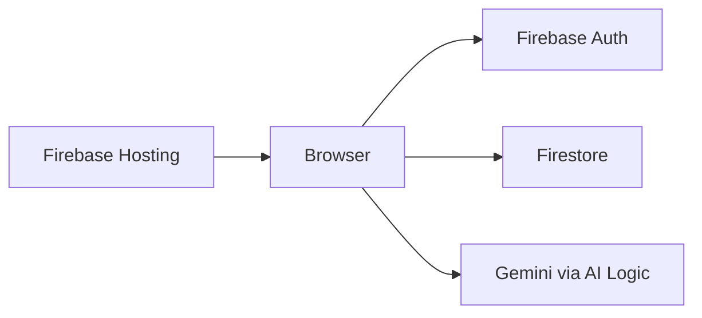

# cappy.ai - Project Documentation

A study assistant that runs entirely on Firebase's free (Spark) plan.

---

## 1. Overview

Students upload PDF notes and then summarise them, take quizzes, search them, and generate or solve exam papers. All answers come from the student's own notes.

The app is a React website. It talks directly to three Firebase services, so there is no server to run or pay for.

| Need | Firebase service |
| :--- | :--- |
| Show the website | Hosting |
| Log people in | Authentication |
| Store notes and history | Firestore |
| Write answers and quizzes | AI Logic (Gemini) |

---

## 2. How a request flows

```mermaid
graph LR
    B[Browser] --> A[Firebase Auth]
    B --> F[Firestore]
    B --> G[Gemini via AI Logic]
    H[Firebase Hosting] --> B
```

Example: generating a summary.

1. The browser loads the note blocks for the chosen documents from Firestore (one read per block).
2. It picks the most useful chunks (by topic if one was given, otherwise a spread across the notes).
3. It sends those chunks and the instructions to Gemini through AI Logic.
4. The result is shown on screen.

---

## 3. What is stored in Firestore

Everything lives under one user, so a person's data is easy to find and easy to protect.

| Path | What it holds |
| :--- | :--- |
| `users/{uid}` | Name, email, study field, join date |
| `users/{uid}/documents/{id}` | One uploaded PDF: name, size, pages, status, category |
| `users/{uid}/documents/{id}/blocks/{n}` | The PDF's text, about 150 chunks per block |
| `users/{uid}/conversations/{id}` | One chat: title and dates (see note below) |
| `users/{uid}/conversations/{id}/messages/{id}` | One message: who said it, text, sources |
| `users/{uid}/papers/{paperId}` | A generated exam paper, so it can be solved later |
| `users/{uid}/usage/{yyyy-mm-dd}` | How many papers were solved today |

> Note: the chat page exists in the code and its service is ported, but it has no route or menu link yet, so no chat data is created today.

### User fields

| Field | Meaning |
| :--- | :--- |
| `full_name` | Display name |
| `email` | Login email, copied here so the record is easy to recognise in the console |
| `study_field` | Field or stream of study, for example Computer |
| `created_at` | Join time (ISO text) |

The document ID is the person's Firebase Auth `uid`, so the rules can match it to the signed-in user. Look the person up by `email` instead.

### Document fields

| Field | Meaning |
| :--- | :--- |
| `filename` | Original file name |
| `file_size` | Size in bytes |
| `page_count` | Pages that had text |
| `chunk_count` | Number of text chunks |
| `status` | `processing`, `ready` or `failed` |
| `category` | Subject label, default `General` |
| `created_at` | Upload time (ISO text) |

### Why blocks?

Firestore charges one read per document. If every chunk were its own document, one question over a 100-page PDF would cost hundreds of reads. Packing about 150 chunks into each block makes the same question cost two or three.

---

## 4. Security

There is no server, so the rules in `firestore.rules` are the security.

| Rule | Effect |
| :--- | :--- |
| Everything is under `users/{uid}` | Only the signed-in owner can read or write it |
| No other paths exist | Everything else is denied |
| Usage counter | Can only go up by 1 per write, never past 7, only for today's date |

Other protections:

| Protection | How |
| :--- | :--- |
| Passwords | Handled and hashed by Firebase Authentication |
| Gemini key | Never in the website; Google keeps it behind AI Logic |
| Abuse of the shared Gemini quota | App Check (reCAPTCHA v3), optional but recommended |

These rules were tested against the live project: owners can use their data, other users are refused, the 8th paper solve is refused, and the counter cannot be reset.

---

## 5. Reading PDFs

Done in the browser by `frontend/src/services/pdf.js`.

| Step | What happens |
| :--- | :--- |
| 1 | pdf.js reads the text layer of each page |
| 2 | A page with fewer than 30 characters is treated as scanned or handwritten |
| 3 | That page is drawn to an image and sent to Gemini to be transcribed |
| 4 | Text is cut into 1000-character chunks with 200 characters of overlap |

The PDF file itself is not stored. Cloud Storage needs a paid plan, and only the text is needed.

---

## 6. Finding the right notes

Done by `frontend/src/services/retrieval.js`.

| Situation | Method |
| :--- | :--- |
| Search | BM25 keyword ranking over the chosen documents |
| Summary, quiz, paper with a topic | Best matches for the topic, lightly shuffled for variety |
| Summary, quiz, paper without a topic | A random spread across the notes |

The relevance score shown in Search is the share of your words found in the chunk, with a bonus for an exact phrase match.

Loaded blocks are cached for the session, so asking a second question costs no extra reads.

---

## 7. AI

Done by `frontend/src/services/ai/`.

| File | Job |
| :--- | :--- |
| `gemini.js` | Calls Gemini, reads image text, repairs broken JSON replies |
| `prompts.js` | The prompts for summaries, quizzes, flashcards, papers and chat answers |

The model name is one constant, `GEMINI_MODEL`, in `gemini.js`.

---

## 8. Pages

| Route | Page |
| :--- | :--- |
| `/login`, `/register` | Sign in and create an account |
| `/dashboard` | Your documents and upload |
| `/summary` | Summaries |
| `/quiz` | Quizzes and flashcards |
| `/sample-paper` | Generate and solve exam papers |
| `/search` | Search all notes |
| `/settings` | Profile, password, theme |

Your email is your login, so it cannot be changed in Settings. Name and field can.

---

## 9. Free plan limits

| Limit | Value |
| :--- | :--- |
| Firestore reads | 50,000 per day |
| Firestore writes | 20,000 per day |
| Firestore storage | 1 GiB |
| Hosting storage and transfer | 10 GB and 360 MB per day |
| Gemini | A shared free quota; the app shows a friendly retry message |
| PDF size | 10 MB per file |
| Paper solves | 7 per person per day |

---

## 10. Deploying

| Task | Command |
| :--- | :--- |
| Build the site | `cd frontend && npm run build` |
| Publish site and rules | `firebase deploy` |
| Publish only rules | `firebase deploy --only firestore` |
| Publish only the site | `firebase deploy --only hosting` |

Setup of Authentication, AI Logic, App Check and the custom domain is listed in the README.

---

## 11. Design decisions

| Decision | Reason |
| :--- | :--- |
| No backend server | Firebase's free plan cannot run one |
| Gemini only | A second provider's key would have to live in the browser |
| Text stored, PDF not | Cloud Storage needs a paid plan |
| Keyword search, not embeddings | Embeddings are not available through AI Logic, and keyword ranking is free |
| Notes packed into blocks | Keeps reads far below the free daily limit |
| Services return the old API shapes | The pages did not need rewriting |
